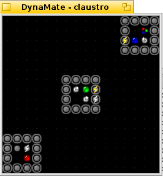

# DynaMate

DynaMate is a game where you try to remove all colored blobs dots from the
screen. There are specific rules as to how you can manipulate each dot,
and what each different colored dot does.

DynaMate is a single-player game with many different levels.

DynaMate runs on the Haiku operating system.
